<p align="center">
  
</p>

<h1 align="center">新诉讼可视化 · New Litigation Visualization</h1>
<p align="center"><b>把法律画出来 · Make the Law Visible</b></p>

<p align="center">
  
  <a href="LICENSE"></a>
  
  
  <a href="https://github.com/MiaoQichuan/mqc-litigation-visual-redraw/actions/workflows/checks.yml"></a>
  
  
  
  
  
  
  
</p>

---

# mqc-litigation-visual-redraw · 诉讼可视化重画

> 把一张凌乱或「AI 味」的诉讼图，重画成克制、专业、可直接进诉讼材料的图。
> **并且把能继续改的源文件一并给你**——PowerPoint、ProcessOn、Visio、WPS、draw.io，
> 用你本来就在用的那个。
> 不改一个字、不改法律含义，只改视觉表达。

**这版最重要的两件事**

| | |
| --- | --- |
| **① 出的不只是图，是能接着改的文件** | 五种格式同时交付。方框、颜色、文字、边框、连线、箭头**逐个可编辑**——不是把图片贴进 PPT，是真正的原生图形。改到哪一步不满意，你自己接着改，不必回来重求一次。 |
| **② 出图前，脚本会问你三件事** | 结构对不对、要哪种风格、重点标哪里。**问题由脚本生成，不是模型现编**——每次问法一样、选项一样、候选清单是你这张图里的真实元素。答完再画，没答就走安全默认。 |

第 ② 条是这个 skill 的一贯主张往前走了一步：**几何由确定性脚本算，交互也由确定性脚本出**。
这三个答案的后果本来就是脚本强制执行的（没授权的红标不出来、未确认的图只叫 `*-draft`），
那么提问本身如果还靠模型自觉，就是整条链上唯一的软环节。

<details open>
<summary align="center"><b>▸ 一张长图 · 从你手上的原图，到能接着改的文件</b></summary>
<br/>
<p align="center">
  
</p>
</details>

**定位**：本 skill（`mqc-litigation-visual-redraw`）是 **新诉讼可视化 / New Litigation Visualization**
的首个开源模块，专责「识别用户上传的丑图/乱材料 → 拆解 → **重画**成标准诉讼图，并交出可继续编辑的源文件」。
后续模块（证据目录、文书生成、案情结构化提取等）将陆续加入同一命名族。本模块可独立使用。

**不限制你的上游。** 手绘翻拍、屏幕截图、别人做的 AI 花图、Mermaid、甚至一段纯文字，都能进来。
案件类型太多、律师习惯差别太大，这个 skill 不要求你跟它对齐——它还原你的思路，只负责把表达做对。

## 30 秒开始

安装（把这段话直接发给有 shell 权限的 Agent 即可）：

```
帮我安装 mqc-litigation-visual-redraw。请把
https://github.com/MiaoQichuan/mqc-litigation-visual-redraw
克隆到 ~/.claude/skills/mqc-litigation-visual-redraw，
装完跑一下 python3 scripts/doctor.py 看环境。
```

装好之后，直接说人话：

```
用这个 skill 改一下这张图，我要提交给法院，重点标注诉讼时效。
```

```
把这份判决书的审理经过画成时间轴，日期都是准的，间隔要按真实比例。
```

```
这是我手绘的当事人关系，帮我画成关系图，出一份能在 ProcessOn 里继续改的。
```

不用学语法、不用套模板、不用改办案习惯。Skill 会先问你三件事，再出图。

## 适合 / 不适合

**适合**：诉讼材料配图 · 案情时间轴 · 当事人/担保/股权关系 · 程序流程与请求权路径 ·
诉讼时效与保证期间比对 · 两裁判要旨对读 · 讲课与公众号配图 · 把别人做的丑图重画一遍

**不适合**：数据图表（柱状/折线/饼图，这不是它的活）· 需要真实地图底图的图 ·
十五个以上节点的超密关系网（会被建议拆成多图，而不是硬塞成一团）·
纯文字排版（它画图，不排版）

## 仓库结构

```
mqc-litigation-visual-redraw/
├── SKILL.md                 技能主文档（工作流、布局选择、红线）
├── README.md · AUTHOR.md · CHANGELOG.md · LICENSE
├── assets/
│   ├── style-tokens.json    冻结的视觉数值（颜色/字体/圆角…）
│   ├── fonts/README.md      标题宋体字体政策
│   ├── screenshots/ · modes/     成品截图与三档对照图
├── schemas/
│   └── semantic-map.schema.json   语义地图 JSON 契约（schema_version:1）
├── references/              规程与标准（英文）
│   ├── STANDARDS.md         单一权威（规则+跨领域决策；数值以各细则为准）
│   ├── extraction-guide.md  ★识别·分析·拆解 六步规程（含纯文字/手绘源）
│   ├── semantic-map-schema.md · visual-style.md · fidelity-rules.md
│   ├── flowchart-spec.md · relationship-spec.md · rendering-and-workflow.md
│   └── visual-style.md      奇川风 / 歸藏风 / 白描 三档冻结标准
├── scripts/                 确定性渲染管线（模型只填 JSON、脚本算全部坐标）
│   ├── render.py            调度 + CLI(validate/lint) + 三档模式后处理 + SVG→PNG
│   ├── common.py            token/字体/wrap(禁则+CJK)/校验/marker
│   ├── render_points·dated·spans·flow·relation·tree·compare.py  七个渲染器
│   ├── audit.py             交付摘要 + 提取门禁(CHECKPOINT)
│   ├── checkpoint.py        生成三问交互(结构/风格/重点)，措辞不随模型摇摆
│   ├── export_drawio.py     可编辑 draw.io（随模式主题化）
│   ├── export_pptx.py       可编辑 PowerPoint（原生图形，非贴图）
│   ├── export_vsdx.py       可编辑 Visio/ProcessOn
│   ├── verify_pptx.py       渲染后量文字实际落点，自检排版
│   ├── audit_edges.py       量边缘墨量，抓光栅不对称
│   ├── make_gallery.py      重生成 README 展示图（--check 断言未过期）
│   ├── doctor.py            环境自检（裸仓库 clone 后第一步）
│   └── lint.py              渲染期视觉 lint（越界/文字溢出/非有限/对角/离色板…）
├── examples/                8 份真实语义地图（覆盖 7 布局；单一真相源，测试直接引用）
└── tests/
    ├── run_checks.py        回归（零依赖，退出码 0=全过）
    └── fixtures/            edge_* 边界压力用例
```

---

## 能做什么

三类图、七种布局，**一套确定性工程 × 三种视觉模式**——布局与走线的规矩不变，
表达按使用场景切换（奇川风 · 歸藏风 · 白描，详见下文「三种视觉模式」）：

| 类型 | 布局 | 适用 |
| --- | --- | --- |
| 时间轴 · 编号型 | `numbered_point_timeline` | 事实经过时间轴（签约→违约→起诉→判决），编号等距圆点卡片；无精确日期或事件密集时的安全默认 |
| 时间轴 · 日期型 | `dated_point_timeline` | 精确日期、间隔有法律意义的长跨度年表，按真实日期成比例的诚实刻度轴 |
| 时间轴 · 期间型 | `proportional_gantt` | 诉讼时效 / 保证期间 / 履行期间，按真实日期成比例的甘特条（条长与重叠即法律主张） |
| 流程图 | `graphviz_flow` | 案件程序 / 请求权路径 / 攻防路径，圆角步骤 · 六边形判断 · 胶囊起止；TB/LR 双向 |
| 关系图 · 网络 | `graphviz_relation` | 当事人关系 / 担保 / 股权 / 资金流，自由布局 + 带标签有向关系线 |
| 关系图 · 层级树 | `relation_tree` | 实际控制人 → 控股 → 子公司等严格层级结构，对称树、等高等宽、深度渐变 |
| 关系图 · 对比表 | `comparison_table` | A vs B 逐维度横向对读（两裁判要旨 / 两诉讼方案），关系类的对比变体 |

<details>
<summary><b>▸ 展开长图 · 三类七种图形，怎么选</b></summary>
<br/>
<p align="center">
  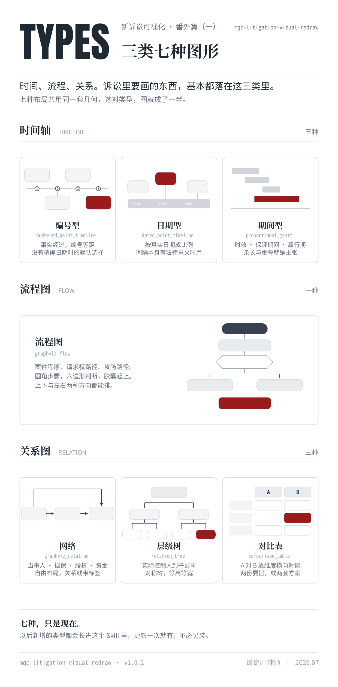
</p>
</details>

## 交付什么 · 五种格式，一份母版

每次渲染同时写出五个文件。**它们全部转写自同一份母版 SVG**——不是各画一遍，
所以不存在「PPT 里和图上不一样」这种事，也没有第二个地方会漂。

| 文件 | 在哪儿打开 | 你能改什么 |
| --- | --- | --- |
| `.svg` | 浏览器 / Illustrator / Figma | 母版，矢量全可编辑 |
| `.png` | 插进 Word、直接打印 | 交付/提交用的定稿位图 |
| **`.pptx`** | **PowerPoint · WPS · Keynote** | 每个方框是原生图形，**文字住在图形里**，双击就改；直线是原生连接线，折线逐点复刻 |
| **`.vsdx`** | **ProcessOn · Visio · WPS · 亿图** | 同上，形状/文字/线型/箭头全是原生对象 |
| `.drawio` | draw.io / diagrams.net | 随视觉模式主题化，ID 与几何不变 |

**为什么是 `.vsdx` 而不是别的。** ProcessOn 能导入十种格式，其中八种（xmind / mmap / km / mm /
opml / md / txt / csv）是**大纲和思维导图**格式——诉讼图塞进去，精确日期、正交走线、**箭头方向**
会被压成一棵树，法律含义直接丢失，那比不出更糟。它自家的 `.pos` 保真度最高，但**没有公开规范**，
只能逆向、且随时可能改版。`.vsdx` 是公开标准，一份文件同时喂饱 ProcessOn / Visio / WPS / 亿图，
而且能被回读校验——**我们对它做了逐字测量，不是做完就交**。

> **可编辑 ≠ 贴图。** 判断标准很简单：在 PowerPoint 里点一下方框，选中的是**这个方框**，
> 不是一整张图片；双击能改字；改填充色能改；拖动能拖。

## 出图前的三问 · 交互也是确定性的

```bash
python3 scripts/checkpoint.py map.json --suggest=<n>
```

脚本读你这张图，生成三个问题，Agent 原样贴给你：

```
① 结构 ─────────────────────────────
   图种　时间轴 · 期间型　·　期间的长短与重叠本身就是法律要点
   内容　7 个期间 · 3 个节点
   存疑　1 处，会影响法律含义
　　　　· 各期间起止日期依原图文字逐字保留…
   ▸ 图种若读错，同族可换：编号型 / 日期型

② 风格 ─────────────────────────────
   1　奇川风　推荐
　　　宋体标题 · 灰阶分层 · 单一深红点睛
　　　多数场合通用 —— 呈报法庭、交当事人、内部办案皆可
   2　歸藏风
　　　克莱因蓝 · 浅灰点阵底 · 无衬线 · 直角发丝线
　　　对外传播 —— 线上发布、课件、分享
   3　白描
　　　纯黑白线稿 · 实心块转白底框线 · 近直角
　　　须为纯黑白时 —— 打印、影印、卷宗附件
   ▸ 不回 = 1

③ 重点 ─────────────────────────────
   深红只标一处：本案的胜负手。
   建议标　11　【法院审理】查明事实
   ▸ 不回 = 采纳建议　·　回 0 = 全图不标红　·　回别的编号 = 换一处
```

三条设计取舍，都是踩出来的：

- **图种是「校对」不是「点菜」。** 图种由数据决定（没有可解析的日期，就画不出按比例的日期轴），
  所以摆出判定依据让你核对，只列同族里**真正换得了**的。把做不到的选项摆出来让人选，是骗人。
- **每档同时说「样子」和「适合」。** 只说样子你判断不了该选哪个，只说场景又变成替你归类。
- **候选超过十个就不列。** 十六行不是菜单，是一堵墙。律师比谁都清楚自己案子的关键在哪，
  直接说要标哪一处，比在十六行里找编号快。

**不回答会怎样**：奇川风、AI 挑一处红并说明理由、五种格式全出、文件名带 `-draft`。
图照出，不卡人；但没有一处是替你做了你没同意的决定——
**没授权的红标脚本会直接剥掉**，终稿的名分也要你确认过才给。

## 成品示例

`examples/` 直接渲染出的 **7 种图表类型**（下图为默认的 **奇川风**：宋体标题、灰阶 + 唯一深红 `#991B1B`）：

<table>
  <tr>
    <td width="50%" align="center">
      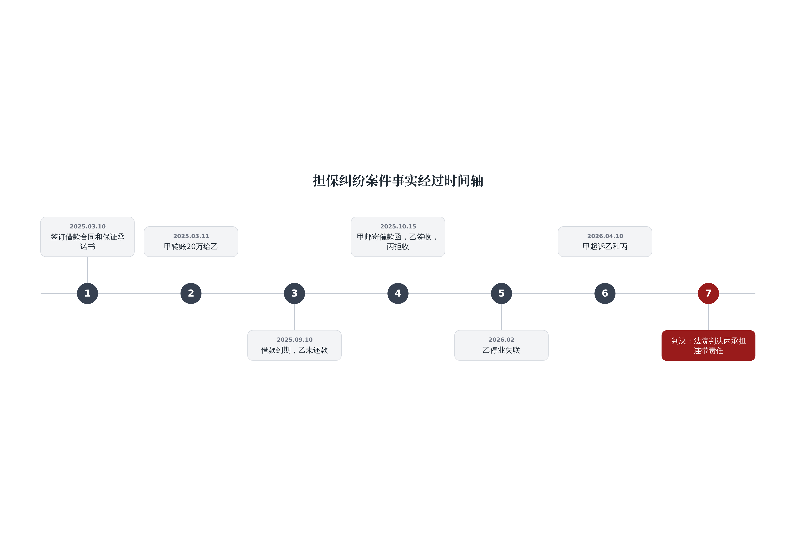<br/>
      <b>时间轴 · 编号型</b> · <code>numbered_point_timeline</code>
    </td>
    <td width="50%" align="center">
      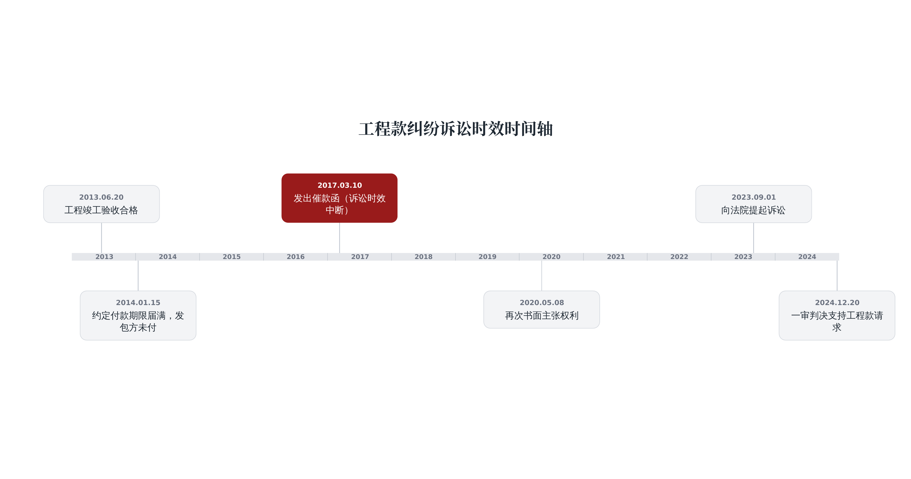<br/>
      <b>时间轴 · 日期型</b> · <code>dated_point_timeline</code>
    </td>
  </tr>
  <tr>
    <td width="50%" align="center">
      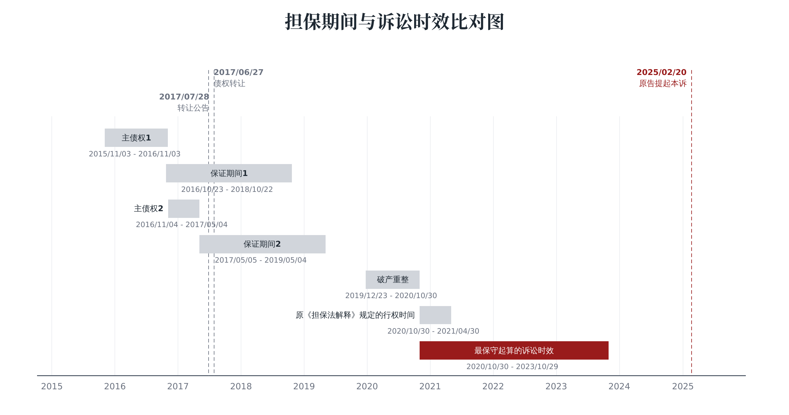<br/>
      <b>时间轴 · 期间型</b> · <code>proportional_gantt</code>
    </td>
    <td width="50%" align="center">
      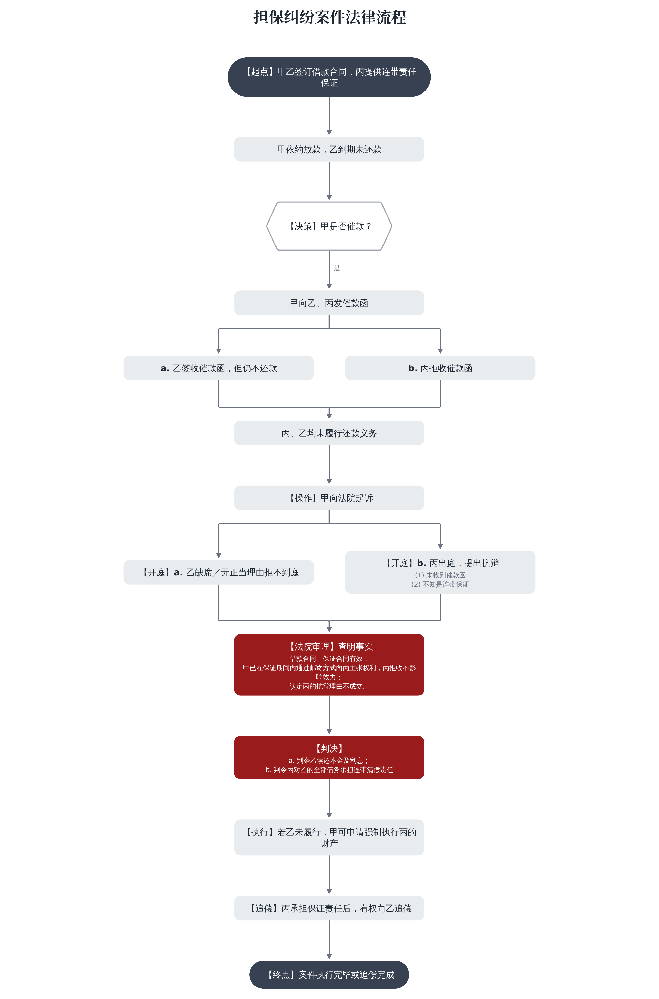<br/>
      <b>流程图</b> · <code>graphviz_flow</code>
    </td>
  </tr>
  <tr>
    <td width="50%" align="center">
      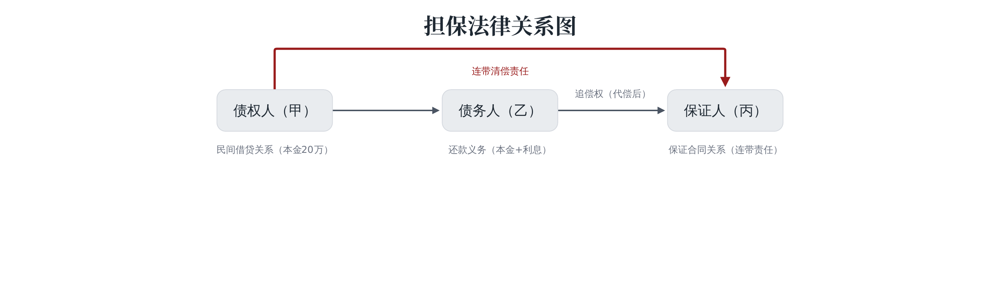<br/>
      <b>关系图 · 网络</b> · <code>graphviz_relation</code>
    </td>
    <td width="50%" align="center">
      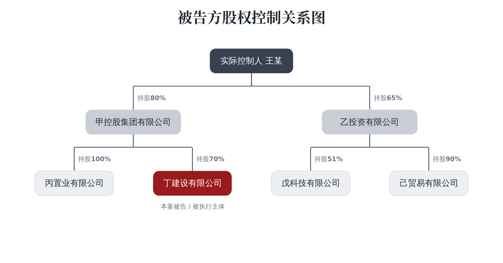<br/>
      <b>关系图 · 层级树</b> · <code>relation_tree</code>
    </td>
  </tr>
  <tr>
    <td width="50%" align="center">
      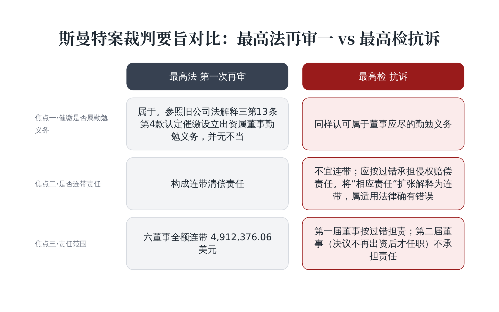<br/>
      <b>关系图 · 对比表</b> · <code>comparison_table</code>
    </td>
    <td width="50%"></td>
  </tr>
</table>

### 同一张图 · 三种模式

**同一套几何**（确定性布局 + 正交走线），换三种表达 —— 顺序均为
**奇川风 · 歸藏风 · 白描**（流程图为横排，其余为竖排，自上而下）：

| 图表类型 | 三档对照 |
|---|---|
| 流程图 |  |
| 关系图 · 网络 |  |
| 关系图 · 层级树 | 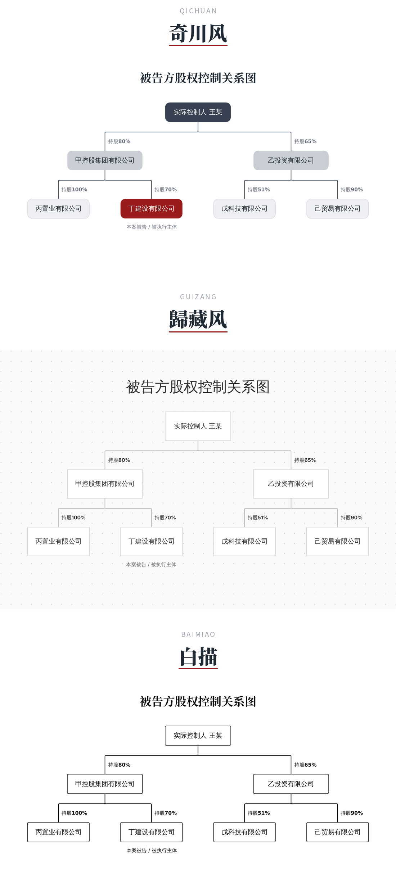 |
| 时间轴 · 编号型 | 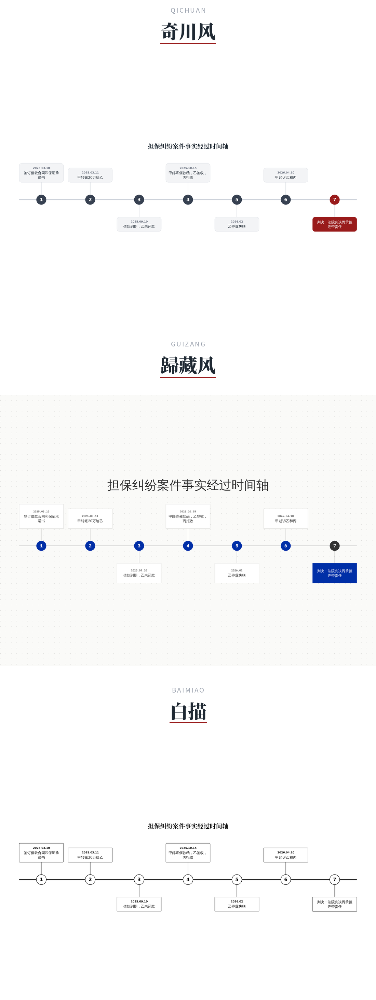 |
| 时间轴 · 日期型 |  |
| 时间轴 · 期间型 |  |
| 关系图 · 对比表 | 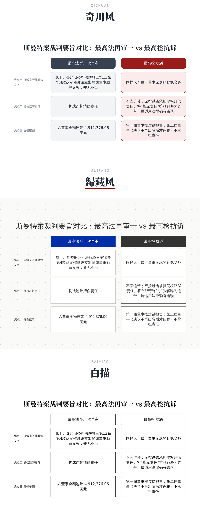 |
| **压力测试** · 密集关系图 | 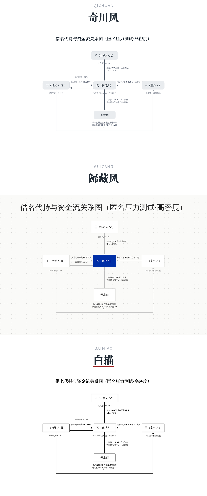 |

## 三种视觉模式

同一套布局与走线**工程**（奇川风的规矩：确定性布局、正交走线、不穿节点、标签不压线），
三种**艺术表达**，对应三种场景。奇川风是母版；另两档只在被请求时生效，母版逐字节不受影响。

**为什么默认那档最通用**：奇川风去掉红标之后，全图最大彩度不到 10%，肉眼读作中性灰——
影印、传真都不失真，进法庭材料并不违和。红是 opt-in 的，所以默认路径天然是保守的。

| 模式 | 触发 | 视觉 | 场景 |
|---|---|---|---|
| **奇川风** | 默认 · 推荐 | 宋体标题、灰阶分层 + 一处深红 `#991B1B`、圆角实心卡、决策圆角六边形 | 多数场合通用 —— 呈报法庭、交当事人、内部办案皆可 |
| **歸藏风** | `--guizang`（别名 `--swiss`/`--ikb`）或 `"visual_mode":"歸藏风"` | 克莱因蓝 `#002FA7` 作**唯一锚点色**、浅灰点阵底、无衬线中文 + IBM Plex Mono 数字（带字距）、直角发丝边、大居中轻标题 | 对外传播 —— 线上发布、课件、分享 |
| **白描** | `--baimiao`（别名 `--mono`/`--print`/`--court`）或 `"visual_mode":"白描"` | 纯黑白线稿：全部 `#111111`、纯色块转白底框线、模块收方至近直角 | 须为纯黑白时 —— 打印、影印、卷宗附件 |

歸藏风的蓝**只落在重点上**：流程图决策菱形与起终点、关系图枢纽、时间轴重点事件、
期间型的关键期间——一律蓝底白字，其余为中性灰 / 白。**点阵底是浅灰不是蓝**：
这套风格的规矩是「单一高饱和锚点色」，把蓝铺成底纹等于把唯一的锚点花在背景上，
底纹反过来和内容抢注意力。冻结标准见 `references/visual-style.md`。

<details>
<summary><b>▸ 展开三档视觉系统长图</b></summary>
<p align="center">
  <br/><br/>
  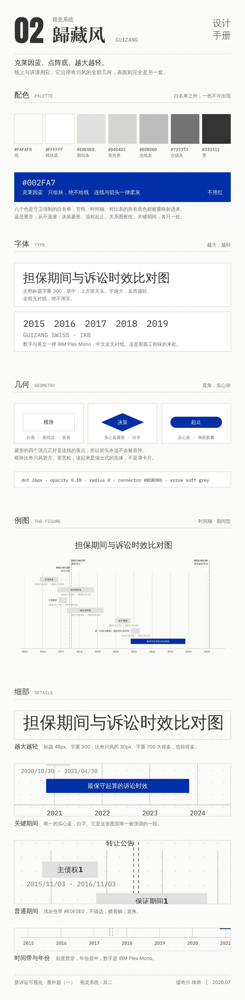<br/><br/>
  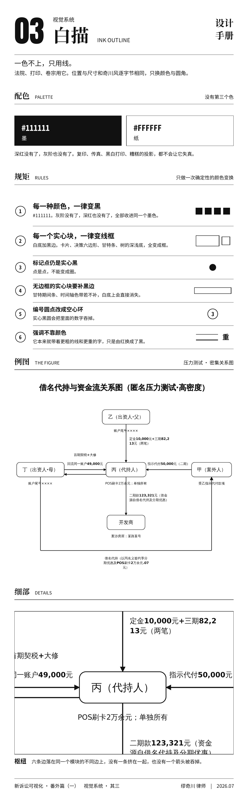
</p>
</details>

## 核心工程原则

1. **模型只产出 JSON，绝不碰坐标。** 所有布局、防重叠、换行、渲染都交给确定性脚本——
   所以在**较弱的模型**上也能出稳定、专业的效果。这是它区别于多数「AI 画图」的地方。
2. **规矩由脚本强制，不是请模型自觉。** 没记录来源的红标，渲染器直接剥掉；
   未确认的图只叫 `*-draft`。一条靠「请违规者自己举报自己」执行的规则，不算规则。
3. **交互也是确定性的。** 三个问题由脚本生成，措辞、选项、候选清单每次一样——
   这三个答案的后果既然是硬的，提问就不该是软的。
4. **五种格式转写自同一份母版**，不各画一遍。没有第二个布局引擎，也就没有第二处会漂。
5. **零第三方 Python 依赖**，只用标准库。`.pptx` / `.vsdx` 都是手写 OOXML——
   律师在任何环境跑它都不用先装东西。
6. **verbatim 铁律**：只改视觉，不删字、不改字、不改法律含义。
7. **每条守卫都必须能失败。** 加一条守卫之后要故意把代码改坏，确认它真的报错——
   这轮抓到过两条「在最需要它的时刻恰好失声」的守卫，那种比没有更危险。
8. **看不见的地方就去量。** 箭头形状、边缘粗细、文字实际落点，都是量出来的数，
   不是「我记得应该是这样」。

## 工作流

1. 读懂原图，逐字提取文字 → 写成 `semantic-map.json`（见 `references/semantic-map-schema.md`）
2. **人工确认 checkpoint**：把提取结果和不确定项给用户确认，再渲染
3. 一条命令渲染：
   ```bash
   python scripts/render.py <semantic-map.json> final
   ```
   产出 `final.svg`（母版）+ `final.png`（预览/提交）+ 三份可继续编辑的文件
   （`.pptx` PowerPoint/WPS、`.vsdx` ProcessOn/Visio/WPS、`.drawio`）+ 自检摘要。
   五份都转写自同一份母版，不会互相漂移；未经确认的产物命名为 `*-draft.*`。
4. 交付 SVG + PNG + PPTX + VSDX + drawio，附一行语义审计

## 快速开始（裸仓库第一步）

`git clone` 只带来代码，不带来它调用的系统工具（graphviz、光栅化器、字体）。
先跑自检，它会告诉你缺什么、怎么装、缺了会退化成什么：

```bash
python3 scripts/doctor.py          # 环境自检（必需项缺失时退出码 1）
python3 scripts/render.py examples/flowchart.json /tmp/out
python3 tests/run_checks.py        # 回归自测
```

## 依赖

- **Python 3** —— 仅标准库，**无需 `pip` 安装任何第三方包**
- **graphviz（`dot`）**：流程图 / 关系图定位需要；时间轴不需要
- CJK 字体（如 Noto Sans CJK SC），否则 PNG 中文显示为空框
- SVG→PNG：自动探测 `rsvg-convert`/`resvg`/`inkscape`/`cairosvg`，都没有则回落 `soffice`(LibreOffice)→PDF→`pdftoppm`

## 标题字体（宋体）与开源合规

图表**标题**使用宋体（公文标题气质），正文/卡片仍为黑体。标题字体按三层降级：

1. **优先·真身**：方正小标宋简体（商业字库，**只按名引用、绝不打包分发**）。想要真正的小标宋效果，
   请在自己机器上安装方正小标宋（很多律师的 WPS/方正字库已含）。
2. **优先·开源回退**：思源宋体（Source Han Serif / Noto Serif CJK，OFL 可合法分发、装机极广、且本渲染
   环境出 PNG 用的就是它）。同一款字在不同系统注册名不同，故三个别名都列入。
3. **兜底**：华文中宋（STZhongsong，Office/WPS 自带，约一半机器都有）→ 通用 `serif`。**全程宋体，绝不落到仿宋。**

标题一律**加粗**（`font-weight:700`；SVG 母版另加 0.3 描边微增笔重）。经 soffice 出 PNG 时会**改用已装宋体的真实粗体字面并去掉描边**（描边会让 LibreOffice 把标题转成错字体轮廓，故仅母版保留）。生成的 **PNG 按本机
已装的最优宋体出图**：装了方正小标宋就用真身，否则用思源宋/华文中宋。SVG 母版携带完整字体栈，
在装有小标宋的机器上打开即显示真身。

## 示例

`examples/` 下有八份可直接渲染的语义地图，覆盖全部七种布局：`timeline-points.json`、
`timeline-dated.json`、`timeline-gantt.json`、`flowchart.json`、`flow-contract-review.json`、
`relationship.json`、`relation-tree.json`、`comparison-table.json`。

## FAQ

**图片贴进 PPT 和这个有什么区别？**
贴图是一张不能动的图片；这里每个方框、每段文字、每条线都是**原生对象**。
点一下选中的是那个方框，不是整张图；双击就能改字。

**为什么不出 `.pos`（ProcessOn 自家格式）？**
它保真度最高，但没有公开规范，只能逆向，且随时可能改版——**我们无法验证它**。
`.vsdx` 是公开标准，一份文件同时能在 ProcessOn / Visio / WPS / 亿图里打开，
而且 LibreOffice 能回读，所以我们对它做了逐字测量。

**能出 Xmind 吗？**
不建议。Xmind 是**大纲/思维导图**格式，诉讼图塞进去，精确日期、正交走线、箭头方向
会被压成一棵树，法律含义直接丢失。宁可不出，也不出一个看着像、意思错了的东西。

**我不回答那三个问题会怎样？**
照常出图：奇川风、AI 挑一处红并说明理由、五种格式全出、文件名带 `-draft`。
没有一处是替你做了你没同意的决定。

**深红能不能多标几处？**
你指定的最多两处；AI 替你挑的**只有一处**，而且必须在交付时说明是它挑的。
红在诉讼图里标的是「本案胜负手」，多了就等于没标。

**它会改我的文字吗？**
不会。verbatim 是铁律：只允许插换行、拆成多图、把存疑写进审计摘要，
**不删字、不改字、不改法律含义**。

**跑一次要装什么？**
Python 3 + graphviz + 一个光栅化器（soffice/rsvg/inkscape 任一）。
零第三方 Python 依赖。`python3 scripts/doctor.py` 会逐项告诉你缺什么、缺了会退化成什么样。

**怎么确认它没画错？**
`python3 tests/run_checks.py` —— 126 项回归守卫，几何、排版、交付、三档一致性全覆盖，
每一条都做过"故意改坏必须报错"的验证。另有 `verify_pptx.py`（渲染后量文字实际落点）
和 `audit_edges.py`（量边缘墨量）两个自检工具。

## 自测（改动后请运行）

```bash
python tests/run_checks.py     # 回归：渲染 / 该报错就报错 / 几何 / 交付 / 排版 / 树-flow-标准；退出码 0 = 全过
```

回归套件把已修复的问题固化成守卫：节点不重叠、箭头必指向 head、分叉等高、判断分支标签不相撞、
甘特条不越界、关系标签不遮挡、特殊字符转义、深红纪律（每图 ≤2 处）、审计摘要真的会运行（不静默失效）、
中文换行遵守禁则（行首不出现收尾标点，且逐字不改）。

---

> **把法律画出来 · Make the Law Visible** ｜ 新诉讼可视化 New Litigation Visualization ｜ 缪奇川 出品 ｜ v1.0.2
