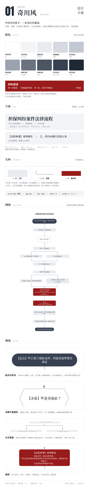
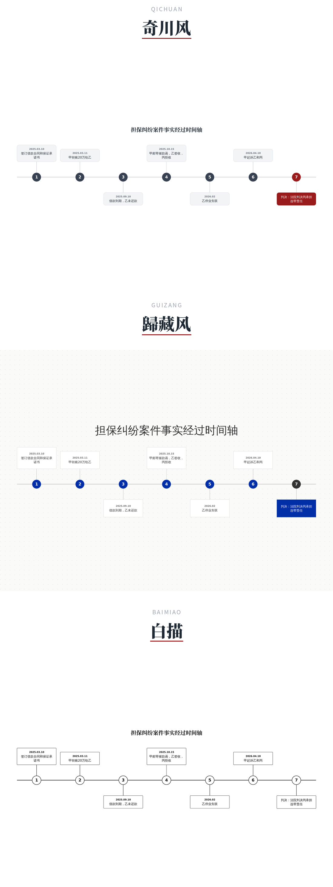
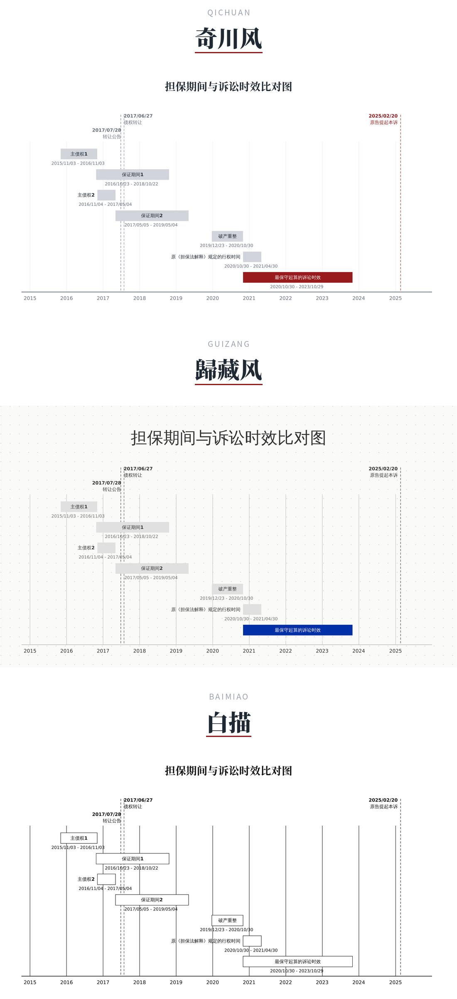
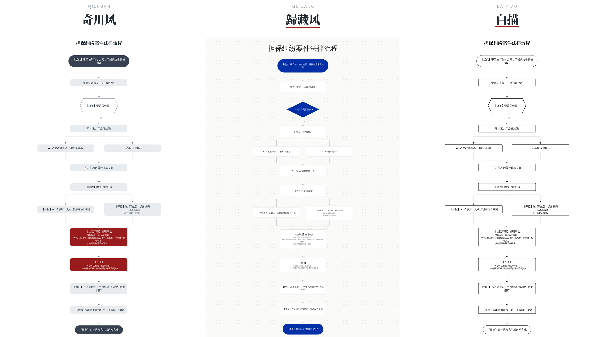
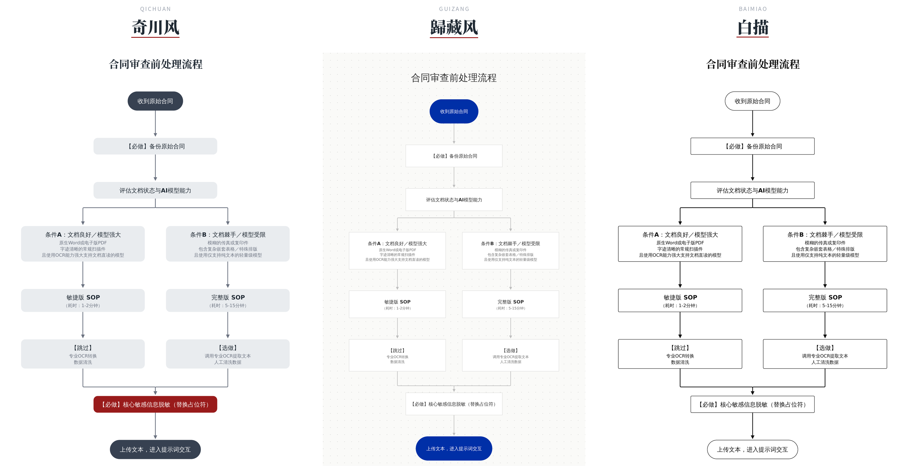
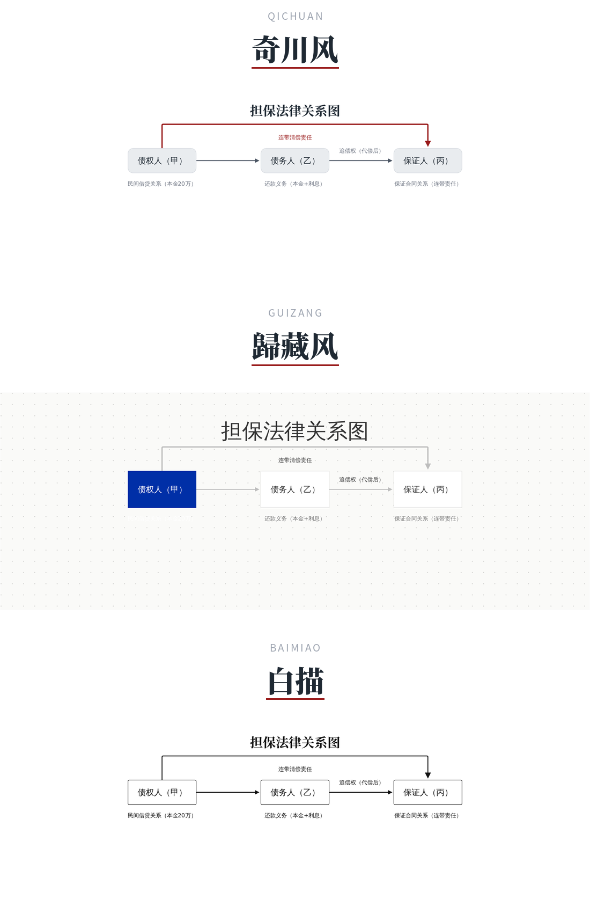

<p align="center">
  
</p>

<p align="center">
  <a href="LICENSE"></a>
  
  
  <a href="https://github.com/MiaoQichuan/new-litigation-visualization/actions/workflows/checks.yml"></a>
  
  
  
  
  
</p>

---

几乎每个法律人都说诉讼可视化是好东西：讲座上点头，朋友圈转发，也羡慕那些图做得
漂亮的同行。可真到自己办案，绝大多数人还是回到老样子 —— 大段大段的文字、密密麻麻
的表格、一份谁也不愿意多看一眼的代理词。心里那道坎是：画图，会不会显得不够专业。

**画图不是把法律变轻佻，而是把思考变透明。** 一段绕来绕去的长论未必是严谨，有时
只是想得还不够清楚，便用文字盖住了。可视化恰恰相反 —— 它逼你先把案子想透，再把
骨架摊开，每一个节点、每一条因果，都经得起对方和法官逐一推敲。能画出来，本身就是
对法律有深度的理解。而今天连门槛都没有了：过去要花大功夫才能做出来的图，几句话、
一个下午就能完成。

诉讼可视化不是新词。在它前面加一个「新」字，不是要另起炉灶，而是顺着前人趟出来的
路接着往下走 —— 视野从画一个案子放大到整个法律世界，深度从画看得见的事实往下沉到
把法律推理本身结构化，工具由 AI 把门槛抹平。**这个仓库是这套体系里「工具」那一层
的开源实现**：给你的不是照着画好的某一张图，而是一套能画出你自己那张图的工具，
以及它背后那套可以被检验的规矩。

它为法律人的工作习惯而写，不是给设计师用的绘图软件：材料怎么顺手怎么给，中文说一句
要什么就出图；出来的东西是 A4 打印得下、能插进代理词、能在 PPT 里继续改的成品；
图上每一句话都指得回材料里的哪一句。**你不需要写代码，也不需要懂它内部怎么算。**

## 现在有什么

两个模块，都是可以直接拿去办案用的成品：

| 模块 | 状态 | 一句话 | 输入 | 输出 |
| --- | --- | --- | --- | --- |
| [**诉讼可视化重画**](plugins/mqc-nlv/skills/mqc-litigation-visual-redraw/) | v1.0.2 已发布 | 你先画一张，它升级审美 | 一张已有的图（手绘、截图、AI 生成、Mermaid、甚至一段纯文字） | SVG · PNG · PPTX · VSDX · drawio |
| [**时间轴大师**](plugins/mqc-nlv/skills/mqc-timeline-master/) | 开发中 | 直接吃材料，把经过画准 | 判决书 · 起诉状 · 答辩状 · 合同 · 证据目录 · 流水 · 聊天记录 · 扫描件 · 照片 · 口述 | 同上 + 溯源索引 Word |

**更多模块会陆续在这个仓库里开源**（证据目录、文书生成、案情结构化提取等），
共用同一套几何与视觉内核，命名同族。**每个模块都可独立使用。**

**支持 DeepSeek Harness。** 两个模块都是标准的 `SKILL.md` 目录，没有任何产品特定的
胶水代码 —— Claude Code、Codex、DeepSeek Harness、Cursor、Gemini CLI、Copilot、
Cline、Aider 都装得上，同一份仓库不需要维护两套。

## 仓库结构

```
new-litigation-visualization/
├── assets/                       仓库封面
├── .claude-plugin/
│   └── marketplace.json          插件市场清单
├── plugins/
│   └── mqc-nlv/
│       ├── .claude-plugin/
│       │   └── plugin.json       插件清单（版本只在这里声明）
│       └── skills/
│           ├── mqc-litigation-visual-redraw/    诉讼可视化重画
│           │   ├── SKILL.md      技能主文档
│           │   ├── references/   规程与标准
│           │   ├── scripts/      确定性渲染管线
│           │   └── schemas/ examples/ assets/ tests/
│           └── mqc-timeline-master/             时间轴大师
│               ├── SKILL.md      技能主文档
│               ├── references/   规程与约束表（69 条编号约束）
│               ├── scripts/      确定性渲染管线
│               ├── docs/adr/     一件事为什么这么定
│               └── schemas/ examples/ assets/ tests/
└── .github/workflows/checks.yml  每次 push 与 PR 自动跑全部回归
```

**共享内核只有一份。** 多个模块共用的几何、字体、换行、导出代码放在插件根，模块
不许各自分叉一份。这是纪律，不是设计。

## 诉讼可视化重画

把一张凌乱、或者一眼「AI 味」的诉讼图，重画成克制、专业、可直接进诉讼材料的图，
并把能继续改的源文件一并交给你。**律师只做两件事：上传原图，说一句改图的提示词。**

<p align="center">
  
</p>

### 三类七种布局

时间、流程、关系 —— 诉讼里要画的东西基本都落在这三类里。**图种不由你选，由材料的
性质算出来。**

<p align="center">
  
</p>

### 三种视觉风格

同一份数据、同一套几何，只换表面。**位置与尺寸一字不差。**

<p align="center">
  
</p>

<p align="center">
  
</p>

<p align="center">
  
</p>

### 七种布局 × 三种风格

每一种布局在三种风格下的样子，逐张对照。

<p align="center">
  
</p>
<p align="center"><sub>编号型时间轴　numbered_point_timeline</sub></p>

<p align="center">
  
</p>
<p align="center"><sub>日期型时间轴　dated_point_timeline</sub></p>

<p align="center">
  
</p>
<p align="center"><sub>期间型时间轴　proportional_gantt</sub></p>

<p align="center">
  
</p>
<p align="center"><sub>流程图　graphviz_flow</sub></p>

<p align="center">
  
</p>
<p align="center"><sub>流程图 · 合同审查路径</sub></p>

<p align="center">
  
</p>
<p align="center"><sub>关系网络　graphviz_relation</sub></p>

<p align="center">
  
</p>
<p align="center"><sub>关系网络 · 密集情形</sub></p>

<p align="center">
  
</p>
<p align="center"><sub>层级树　relation_tree</sub></p>

<p align="center">
  
</p>
<p align="center"><sub>对比表　comparison_table</sub></p>

模块完整说明见 [它自己的 README](plugins/mqc-nlv/skills/mqc-litigation-visual-redraw/)。

## 时间轴大师

**更多模块会陆续在这个仓库里开源，时间轴大师是第二个。**

不用你先画。把判决书、起诉状、答辩状、合同、证据目录、流水、聊天记录、扫描件、
手机照片、甚至一段口述丢给它，它读完最多问你五个问题，然后出图。

**时间轴大师，用数学，画准一张时间轴。**

<p align="center">
  
</p>
<p align="center"><sub>真实输出：八个事项、深红标在你指定的那一处、A4 横版直接打印</sub></p>

### 用数学算清楚一张时间轴怎么画

<p align="center">
  
</p>

### 前端负责读懂，后端负责算准

<p align="center">
  
</p>

### 使用手册

<p align="center">
  
</p>

模块完整说明见 [它自己的 README](plugins/mqc-nlv/skills/mqc-timeline-master/)。

## 安装

Claude Code：

```
/plugin marketplace add MiaoQichuan/new-litigation-visualization
/plugin install mqc-nlv@mqc-nlv
```

装完在有 shell 权限的环境里跑一次环境自检，它会逐项告诉你缺什么、缺了会退化成
什么样：

```bash
python3 plugins/mqc-nlv/skills/mqc-litigation-visual-redraw/scripts/doctor.py
```

### DeepSeek Harness

挂目录即可，不必构建（dsh 的技能发现是扁平的，指到 `skills/` 这一层，它会扫到
下面每一个 `<模块名>/SKILL.md`）：

```yaml
skills:
  local:
    customSkillDirs:
      - "./new-litigation-visualization/plugins/mqc-nlv/skills"
```

dsh 的技能发现优先级（先命中先生效）：项目 `.dsh` → 项目 `.agents` →
`customSkillDirs` → 用户 `.dsh` → 用户 `.agents`。dsh 目前把 `allowed-tools` /
`disallowed-tools` 当未知字段处理，技能内的工具约束需要你在 harness 层自行保证。

### 其他 agent

Codex、Cursor、Gemini CLI、Copilot、Cline、Aider 等：把模块目录放进它们各自的
skills 目录即可，`SKILL.md` 是通用格式。

## 常见问题

### 装与跑

**我不会写代码，能用吗？**
能。你只需要把材料丢给 agent、用中文说一句要什么。全程不写代码、不改配置、
不学任何语法。

**它要联网吗？我的案卷会不会传出去？**
这两个模块不联网、不调外部接口、不需要任何凭据 —— 它只读你给它的材料、只往你
指定的目录写文件。你的材料本身去了哪里，取决于你用的那个 agent 怎么处理，
与这两个模块无关。

**要装什么？会不会很麻烦？**
Python 3（零第三方依赖）。出 PNG 需要 LibreOffice 或 poppler，读扫描件需要
poppler 的 `pdftoppm`，溯源索引需要 node。跑一次 `doctor.py` 它会逐项告诉你缺
什么、缺了会退化成什么样 —— 不是「装不上」，是「少一种格式」。

### 材料怎么给

**材料要先整理好吗？**
不用。怎么顺手怎么给：Word、txt、Markdown、PDF、截图、照片都行，多份一起给也行。
不用改格式、不用先摘出时间点、不用自己先画一张。

**扫描件和手机拍的照片能读吗？**
能。没有文字层的材料它会先探测、再按 150 DPI 栅格化、然后逐页看图。交付时会明写
哪几份出自读图 —— 那几项没有文字层可以逐字比对，请你自己复核一遍。

**一堆材料一起给，它会不会读混？**
它会先问你这张图用哪几份材料。而且每一个事项都记着出自哪一份、哪一句，
溯源索引里逐项列出来。

### 出来的图

**图能直接交法院吗？**
A4 打印是设计前提，不是导出选项 —— 排布的每一个数都从纸的物理尺寸算起，所以插进
Word 直接能印。要交法院就选白描：纯黑白线稿，复印、传真、黑白打印都不失真。

**能在 PPT 里继续改吗？**
能。五种格式同时交付：SVG（主交付物）、PNG（位图）、PPTX（原生对象，每个方框
双击就能改字）、VSDX（ProcessOn / Visio / WPS）、drawio。五份都转写自同一份母版。

**它会不会改我材料里的字？**
不会，这是铁律。卡片上每一段文字必须是原句删掉一些字之后剩下的样子 —— 换一个词、
调一次词序、补一个字，都会在出图之前被拦住。

**万一它画错了怎么办？**
出图的同时会给一份 Word 三线表：图上每一个元素，出自材料的哪一份、哪一句。打印
出来夹在卷宗里，逐项对得回去。哪一项不对，你当场就能指出来。

**它会不会自己下法律判断？**
不会。它只画材料里已经写着的、已经发生的事。合同条款是约定、诉请是主张、付款
计划是承诺 —— 三者都不进主轴。要画「到期未付」，材料里得另有记载。

**排不开的时候它会怎么做？**
不缩字号、不截断、不硬塞。它会停下来告诉你排不开，请你减少事项或者换一种画法。
一张看着正常其实排错了的图，才是最危险的那一种。

### 两个模块怎么选

**重画和时间轴大师有什么区别？我该用哪个？**
你手上已经有一张图（自己画的、别人给的、AI 生成的），想让它变好看又不变意思 ——
用重画。你手上只有材料、还没有图 —— 用时间轴大师。

**深红标在哪一处，是谁定的？**
你定。深红在诉讼图里标的是本案的胜负手，全图只标一处，多了就等于没标。它会列出
候选让你挑，也可以选不标。你不回答的话它会替你挑一处并说明理由 —— 但会如实记着
这一处是它挑的，不是你定的。

**图种和泳道是我选还是它选？**
它算。编号型 / 日期型 / 期间型由材料的性质按几何算出来；单泳道 / 双泳道 / 三泳道
由材料里有几方各自的主张决定。日期型排不开就走编号型，横向排不开就转成纵向长图
并分页 —— 它永远给得出一张图，或者当场告诉你为什么给不出。

## 工程

```bash
python3 plugins/mqc-nlv/skills/mqc-litigation-visual-redraw/tests/run_checks.py
python3 plugins/mqc-nlv/skills/mqc-timeline-master/tests/run_checks.py
```

退出码 0 = 全过。回归套件把已修复的问题固化成守卫。**每条守卫都必须能失败**：加一
条守卫之后要故意把代码改坏，确认它真的报错。一条靠「请违规者自己举报自己」执行的
规则，不算规则。

几条具体的做法，若你也在做类似的东西，或许有参考价值：

- **约束表带实测数字与撞坏记录。** 时间轴大师的
  [`layout-constraints.md`](plugins/mqc-nlv/skills/mqc-timeline-master/references/layout-constraints.md)
  有 69 条编号约束，每条不是意见而是量出来的，多数条目后面记着当初是怎么撞坏的。
- **决策记录写「否掉了什么」。**
  [`docs/adr/`](plugins/mqc-nlv/skills/mqc-timeline-master/docs/adr/) 每一条都有
  「否掉的替代方案」这一节 —— 结论有价值，被排除的路同样有价值。
- **有反例的检查一条不留。** 宁可少一条检查，也不要一条会误判的。会哭狼的报告
  没人看。
- **缺一样只该少一种能力。** 第三方库缺席时退化，不是崩掉。这一条是 CI 上撞出来的。

## 许可

MIT。作者 [缪奇川](https://github.com/MiaoQichuan)，公众号：奇川律师。

---

> **把法律画出来 · Make the Law Visible** ｜ 新诉讼可视化 New Litigation Visualization ｜ 缪奇川 出品
